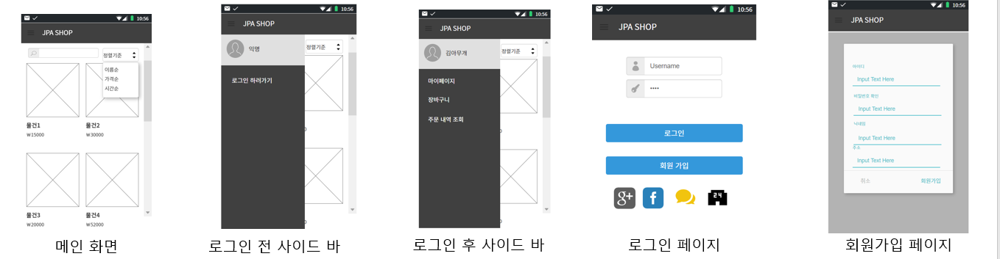
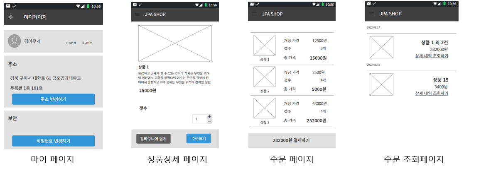

### JPA SHOP(쇼핑몰 프로젝트)

- 간단한 쇼핑몰 프로젝트를 스프링 웹으로 제작

- 백엔드 로직에 집중하기 위해 화면 프로토타입을 카카오 오븐으로 제작 후, 백엔드는 JSON으로 통신함.

- 사용된 기술
        :Spring Boot, Spring Data Jpa, Lombok, MySql, H2 Database

- 후에 적용할 기술 : Spring AOP, Spring Validator, Spring security(OAuth2, Form 로그인)

### 카카오 오븐 프로토타입

