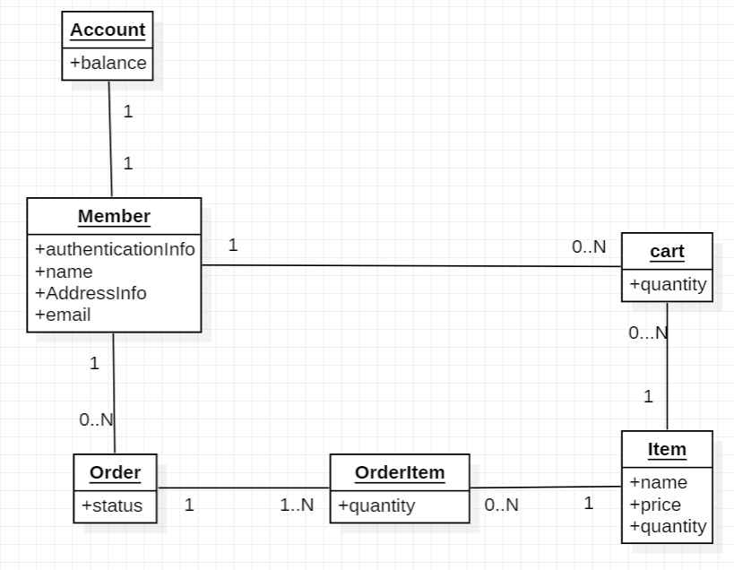
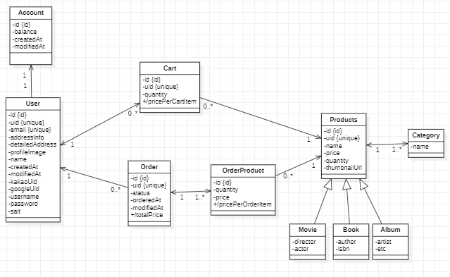

### JPA SHOP(쇼핑몰 프로젝트)

- 쇼핑몰 프로젝트를 스프링 웹으로 제작

- 사용된 기술 
  - Spring Boot
  - Spring Data Jpa
  - MySql
  - H2 Database
  - Swagger

### 기능적 요구사항

1. 상품

   - 사용자는 상품의 리스트를 조회할 수 있으며, 페이지 네이션 기능을 사용해 특정 페이지와 갯수를 지정할 수 있다.
   - 사용자는 검색어(상품 이름), 가격 범위, 카테고리 설정을 통해 상품을 필터링, 검색할 수 있다.
   - 사용자는 상품 리스트 중 특정 상품을 선택해 특정 상품의 이름, 이미지, 상품 설명, 가격 정보, 남은 수량을 확인할 수 있다.
   - 사용자는 특정 상품의 갯수를 선택해 장바구니에 담거나, 바로 결제할 수 있다.   
   - 상품은 영화, 책, 앨범 3종류로 가정하며, 각 상품은 세부 카테고리 정보를 가진다.
2. 회원

   - 사용자는 아이디, 비밀번호, 주소, 이메일 정보를 입력해 회원 가입이 가능하다.
     - Exception 1 : 아이디 또는 이메일 정보가 이미 가입되어 있는 유저의 것과 동일하다면 서비스는 회원가입을 거부한다.
     - Exception 2 : 비밀번호는 영문, 숫자, 특수문자를 모두 포함하며, 8자 이상이여야 한다. 이 조건을 만족하지 못한다면 서비스는 회원가입을 거부한다.

   - 사용자는 Kakao, Google을 사용한 OAuth2 로그인/ 회원가입이 가능하다. 
     - 제약사항 1 : 사용자가 처음 OAuth2로 로그인 했으나 이미 해당 이메일이 가입되어 있다면, 두 계정을 통합한다.
     - 제약사항 2 : 사용자가 처음 OAuth2로 로그인하는 경우 해당 이메일이 존재하지 않는다면, 시스템은 주소 정보를 추가로 입력받아 저장한다.
   - 사용자는 자신의 이름, 이메일, 주소, 프로필 이미지 정보를 조회할 수 있다.
   - 사용자는 자신의 이름, 주소, 프로필 이미지를 수정할 수 있다.
   - 사용자는 자신의 비밀번호를 수정할 수 있다. 이 때 변경되기 이전의 비밀번호를 인증을 위해 추가로 입력해야 한다.
   - 사용자는 자신의 가상 계좌의 이름을 설정해 가상계좌를 추가할 수 있다.
   - 사용자는 자신의 가상 계좌 리스트를 조회할 수 있다.
   - 사용자는 자신의 가상 계좌에 금액을 충전할 수 있다.
     - 사용자는 자신의 가상계좌가 아닌 가상계좌에는 금액을 충전할 수 없다.

3. 장바구니 관리
   - 사용자는 특정 상품과 갯수를 선택해 장바구니에 담을 수 있다.
   - 사용자는 장바구니 리스트에서 특정 물건의 갯수를 조절할 수 있다.
   - 사용자는 장바구니 리스트에서 특정 물건을 선택해 주문할 수 있다. 시스템은 결제 완료된 물건은 장바구니에서 제거한다.

   
4. 주문
    - 사용자는 장바구니 또는 상품 정보 페이지에서 주문을 요청할 수 있다.
    - 시스템은 주문하기 전 사용자가 주문하려는 상품의 리스트, 각 상품의 갯수, 각 상품 당 가격, 총 결제 금액을 사용자에게 제공한다.
    - 사용자가 결제하기 버튼 클릭시 결제가 진행된다.
      - 제약사항 1 : 사용자의 상품 중 재고가 모자란 상품이 있다면 주문에 실패한다.
      - 제약사항 2 : 사용자의 잔액이 총 결제 금액보다 적다면 주문에 실패한다.
    - 사용자는 주문 3일 이내 결제 취소가 가능하다. 결제 취소시 가상계좌로 금액이 입금된다.
    - 사용자는 자신의 주문내역을 조회할 수 있다. 주문 내역은 상품의 리스트, 각 상품의 갯수, 각 상품 당 가격, 총 결제 금액, 결제 일자 정보가 포함되어 있다.

### 비기능적 요구사항

- 보안
  - 사용자의 비밀번호는 암호화되어 저장되어야 한다.
  - 사용자는 마이페이지로 정보를 수정하고자 한다면 자신을 인증해야 한다.
    - 인증 방법 1 : ID/Password를 사용하는 유저라면 비밀번호를 재입력해서 자신을 인증해야 한다.(기본값)
    - 인증 방법 2 : OAuth2를 사용하는 유저라면 설정된 이메일을 통해 인증을 받아야 한다.
- 신뢰성
  - 결제/ 결제 취소 : 사용자의 계좌에서 돈을 빼서 어드민의 계좌로 입금되는 과정은 트랜젝션 원자성을 만족해야 한다.
  - 결제 : 시스템은 한 사용자가 동시에 결제 프로세스를 진행할 수 없도록 제한해야 한다. 동시에 두 결제 요청이 온다면, 두번째 요청은 거부해야 한다.

### Domain Model

### Class Diagram

### 기술적 요구사항

- 계좌 관련 요구사항
  - 입금에 대해서는 동시성 요청을 허가하나, 동시에 들어온 요청에 대해 순차적으로 입금을 수행한다.
  - 출금에 대해서는 동시성 요청을 허가하지 않는다. 즉 동시에 요청이 들어온 경우, 처음 출금 요청만 성공하고 나머지는 실패해야 한다.
  - 입금과 출금이 동시에 요청된 경우, 입금은 수행되나 출금은 실패해야 한다.
  - 계좌의 잔액은 Long Type을 사용한다.
- 주문 관련 요구사항
  - 주문 금액, 물품 금액에 대해선 모두 Integer 타입을 사용한다.