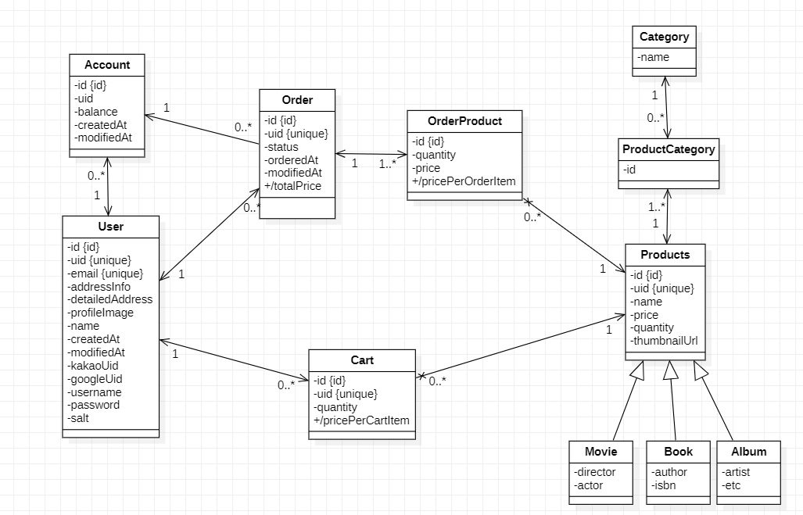

### JPA SHOP(쇼핑몰 프로젝트)

- 쇼핑몰 프로젝트를 스프링 웹으로 제작

- 사용된 기술 
  - Spring Boot
  - Spring Data Jpa
  - MySql
  - H2 Database
  - Swagger
  - Spring Security

### 문서 바로가기

- [요구사항 명세서 바로가기](https://github.com/minturtle/jpa-shop/blob/master/docs/SYSTEM_REQUIREMENTS.md)
- [기능 약정 바로가기](https://github.com/minturtle/jpa-shop/blob/master/docs/OPERATION_CONTRACT.md)

### Domain Model

### Class Diagram

